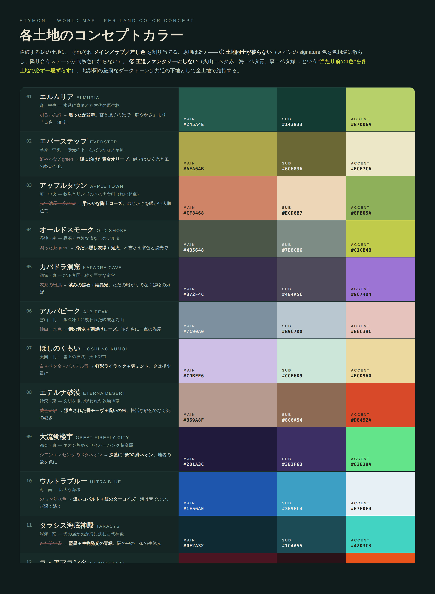
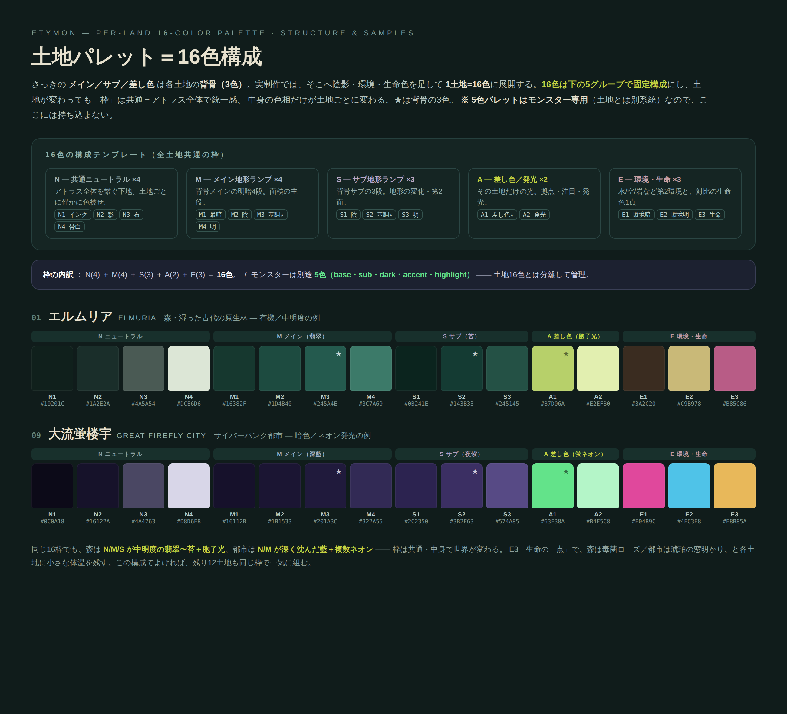
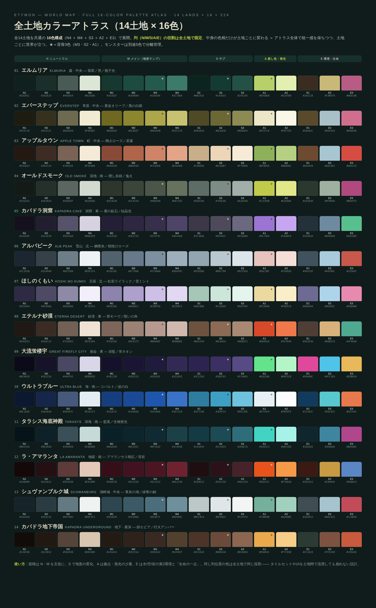

# マップアート配色 — カラーcanon

> **このファイルはEtymon世界地図（マップアート）の配色の正本。**
> 世界観・地理のトーンは [`WORLD_MAP.md`](./WORLD_MAP.md) の §0（ダークファンタジー／初期D&D巻頭図の厳粛な地勢図）に従う。
> チャット履歴ではなく、このファイルの色を実制作・実装の基準とする。

---

## 0. 設計方針

配色は3層に分ける。

1. **背骨（3色）** … 各土地の骨格。**メイン／サブ／差し色**。土地のアイデンティティを決める最小単位。
2. **土地パレット（16色）** … 背骨を陰影・環境・生命色へ展開した、実制作用の1土地の全色。
3. **モンスターパレット（5色）** … 土地とは**別系統**。§4 を参照（本canonでは未確定・別途決定）。

### 2つの原則

- **① 土地同士が被らない** — 各土地メイン（`M3`）の signature 色を色相環にぐるりと分散させ、旅路で隣り合うステージが同系色にならないようにする。
- **② 王道ファンタジーにしない** — 「火山＝ベタ赤」「海＝ベタ青」「森＝ベタ緑」といった各地形の“当たり前の1色”を、土地ごとに必ず一段ずらす（例：森＝明るい葉緑ではなく湿った深翡翠、砂漠＝黄色い砂ではなく漂白された骨モーヴ）。
- 厳粛なダークトーンの下地は全土地共通で維持する（下記 `N` グループが担う）。

---

## 1. 16色の構成テンプレート（全土地共通の枠）

土地が変わっても**列の役割は固定**。中身の色相だけが土地ごとに変わる。★＝背骨の3色。

| グループ | スロット | 役割 |
|---|---|---|
| **N** 共通ニュートラル ×4 | `N1` `N2` `N3` `N4` | インク(最暗/線) / 影(ディープシェード) / 石(ミッドストーン) / 骨白(ハイライト紙)。アトラス全体を繋ぐ下地（土地ごとに僅かに色被せ） |
| **M** メイン地形ランプ ×4 | `M1` `M2` `M3★` `M4` | メイン最暗 / メイン陰 / メイン基調★ / メイン明。面積の主役 |
| **S** サブ地形ランプ ×3 | `S1` `S2★` `S3` | サブ陰 / サブ基調★ / サブ明。地形の変化・第2面 |
| **A** 差し色／発光 ×2 | `A1★` `A2` | 差し色★ / 発光。その土地だけの光（拠点・注目・発光） |
| **E** 環境・生命 ×3 | `E1` `E2` `E3` | 環境暗 / 環境明 / 生命の一点。水/空/岩の第2環境と、対比の生命色1点 |

**内訳 : N(4) + M(4) + S(3) + A(2) + E(3) = 16色。**

使い方の目安 … 面積は `N`・`M` を主役に、`S` で地形の変化、`A` は拠点・発光の少量、`E` は第2環境と「生命の一点」。
同じ列位置の色は全土地で同じ役割なので、タイルセットやUIを土地間で流用しても崩れない。

---

## 2. 背骨カラー（14土地 × 3色）

踏破順（[`WORLD_MAP.md`](./WORLD_MAP.md) §2.2）。「王道 → 採用」＝原則②で外した“当たり前の色”と、その置き換え。

| # | 土地 | 地形 | メイン `M3` | サブ `S2` | 差し色 `A1` | 王道 → 採用 |
|---|---|---|---|---|---|---|
| 01 | エルムリア（Elmuria） | 森 · 中央 | `#245A4E` | `#143B33` | `#B7D06A` | 明るい葉緑 → 湿った深翡翠 |
| 02 | エバーステップ（Everstep） | 草原 · 中央 | `#AEA64B` | `#6C6836` | `#ECE7C6` | 鮮やかな芝緑 → 陽に灼けた黄金オリーブ |
| 03 | アップルタウン（Apple Town） | 町 · 中央 | `#CF8468` | `#ECD6B7` | `#8FB05A` | 赤い納屋/茶 → 柔らかな陶土ローズ |
| 04 | オールドスモーク（Old Smoke） | 湿地 · 南 | `#4B5648` | `#7E8C86` | `#C1CB4B` | 濁った茶緑 → 冷たい燻し灰緑＋鬼火 |
| 05 | カパドラ洞窟（Kapadra Cave） | 洞窟 · 東 | `#372F4C` | `#4E4A5C` | `#9C74D4` | 灰茶の岩肌 → 紫みの鉱石＋結晶光 |
| 06 | アルバピーク（Alb Peak） | 雪山 · 北 | `#7C90A0` | `#B9C7D0` | `#E6C3BC` | 純白/水色 → 鋼の青灰＋朝焼けローズ |
| 07 | ほしのくもい（Hoshi no Kumoi） | 天国 · 北 | `#CDBFE6` | `#CCE6D9` | `#ECD9A0` | 白＋ベタ金＋パステル青 → 虹彩ライラック＋雲ミント |
| 08 | エテルナ砂漠（Eterna Desert） | 砂漠 · 東 | `#B69A8F` | `#8C6A54` | `#D8492A` | 黄色い砂 → 漂白された骨モーヴ＋呪いの朱 |
| 09 | 大流蛍楼宇（Great Firefly City） | 都会 · 東 | `#201A3C` | `#3B2F63` | `#63E38A` | シアン＋マゼンタのネオン → 深藍＋“蛍”の緑ネオン |
| 10 | ウルトラブルー（Ultra Blue） | 海 · 南 | `#1E56AE` | `#3E9FC4` | `#E7F0F4` | のっぺり水色 → 濃コバルト＋波のターコイズ |
| 11 | タラシス海底神殿（Tarasys） | 深海 · 南 | `#0F2A32` | `#1C4A55` | `#42D3C3` | ただ暗い青 → 藍黒＋生物発光の青緑 |
| 12 | ラ・アマランタ（La Amaranta） | 地獄 · 南 | `#4C1522` | `#2A1218` | `#E8531C` | ベタ赤/オレンジの炎 → アマランサスの暗紅＋溶岩一点 |
| 13 | シュヴァンブルク城（Schwanburg） | 湖畔城 · 中央 | `#4C6E7C` | `#DFE6E5` | `#74B09B` | 灰の城＋青の湖 → 青灰の湖＋緑青の銅 |
| 14 | カパドラ地下帝国（Kapadra Underground） | 地下 · 最深 | `#382A22` | `#6B4A3A` | `#E9A94C` | のっぺり暗灰 → 錆セピアの闇＋灯火アンバー |

---

## 3. 土地パレット（14土地 × 16色 ＝ 224色）

全色の正本。列は §1 のテンプレート順（N1…E3）。

### 01. エルムリア — Elmuria

森 · 中央 ／ 翡翠／苔／胞子光

| N1 | N2 | N3 | N4 | M1 | M2 | M3 | M4 | S1 | S2 | S3 | A1 | A2 | E1 | E2 | E3 |
|---|---|---|---|---|---|---|---|---|---|---|---|---|---|---|---|
| `#10201C` | `#1A2E2A` | `#4A5A54` | `#DCE6D6` | `#16382F` | `#1D4B40` | `#245A4E` | `#3C7A69` | `#0B241E` | `#143B33` | `#245145` | `#B7D06A` | `#E2EFB0` | `#3A2C20` | `#C9B978` | `#B85C86` |

### 02. エバーステップ — Everstep

草原 · 中央 ／ 黄金オリーブ／風の白銀

| N1 | N2 | N3 | N4 | M1 | M2 | M3 | M4 | S1 | S2 | S3 | A1 | A2 | E1 | E2 | E3 |
|---|---|---|---|---|---|---|---|---|---|---|---|---|---|---|---|
| `#1E1C10` | `#35311C` | `#6E6A50` | `#F0EBD2` | `#6E6820` | `#8C862F` | `#AEA64B` | `#C8C270` | `#4E4A26` | `#6C6836` | `#8E8A54` | `#ECE7C6` | `#FAF7E6` | `#5A4A2C` | `#A9C0C8` | `#D06E8E` |

### 03. アップルタウン — Apple Town

町 · 中央 ／ 陶土ローズ／若葉

| N1 | N2 | N3 | N4 | M1 | M2 | M3 | M4 | S1 | S2 | S3 | A1 | A2 | E1 | E2 | E3 |
|---|---|---|---|---|---|---|---|---|---|---|---|---|---|---|---|
| `#241813` | `#3E2C24` | `#7A6255` | `#F5E9D8` | `#8A4A38` | `#B0644A` | `#CF8468` | `#E4A488` | `#C9AE8A` | `#ECD6B7` | `#F7EBD8` | `#8FB05A` | `#B6D081` | `#6E4A30` | `#A8C6D2` | `#D64C42` |

### 04. オールドスモーク — Old Smoke

湿地 · 南 ／ 燻し灰緑／鬼火

| N1 | N2 | N3 | N4 | M1 | M2 | M3 | M4 | S1 | S2 | S3 | A1 | A2 | E1 | E2 | E3 |
|---|---|---|---|---|---|---|---|---|---|---|---|---|---|---|---|
| `#141A15` | `#26302A` | `#5A665F` | `#D2DAD0` | `#2E362B` | `#3C453A` | `#4B5648` | `#66725E` | `#5E6C66` | `#7E8C86` | `#A2AEA8` | `#C1CB4B` | `#E2E88A` | `#2A3830` | `#9FB0A0` | `#B0497E` |

### 05. カパドラ洞窟 — Kapadra Cave

洞窟 · 東 ／ 紫の鉱石／結晶光

| N1 | N2 | N3 | N4 | M1 | M2 | M3 | M4 | S1 | S2 | S3 | A1 | A2 | E1 | E2 | E3 |
|---|---|---|---|---|---|---|---|---|---|---|---|---|---|---|---|
| `#14101E` | `#221E30` | `#56526A` | `#D6D2E0` | `#241E36` | `#2E2742` | `#372F4C` | `#4E4468` | `#3C3848` | `#4E4A5C` | `#6C6880` | `#9C74D4` | `#C6A6F0` | `#24303A` | `#6E8AA0` | `#58C08E` |

### 06. アルバピーク — Alb Peak

雪山 · 北 ／ 鋼青灰／朝焼けローズ

| N1 | N2 | N3 | N4 | M1 | M2 | M3 | M4 | S1 | S2 | S3 | A1 | A2 | E1 | E2 | E3 |
|---|---|---|---|---|---|---|---|---|---|---|---|---|---|---|---|
| `#1C2630` | `#354048` | `#6E7E88` | `#EDF2F4` | `#52616E` | `#67798A` | `#7C90A0` | `#9EAFBC` | `#93A5B0` | `#B9C7D0` | `#DCE5EA` | `#E6C3BC` | `#F5DED6` | `#40525E` | `#A9CBDC` | `#C6584C` |

### 07. ほしのくもい — Hoshi no Kumoi

天国 · 北 ／ 虹彩ライラック／雲ミント

| N1 | N2 | N3 | N4 | M1 | M2 | M3 | M4 | S1 | S2 | S3 | A1 | A2 | E1 | E2 | E3 |
|---|---|---|---|---|---|---|---|---|---|---|---|---|---|---|---|
| `#2E2A44` | `#4E4A66` | `#8E8AA6` | `#F2EEFA` | `#8E82AE` | `#ADA0CC` | `#CDBFE6` | `#E2D8F2` | `#A6C6B8` | `#CCE6D9` | `#E6F4EE` | `#ECD9A0` | `#FAEEC8` | `#6E6A94` | `#AED4EC` | `#E88AB0` |

### 08. エテルナ砂漠 — Eterna Desert

砂漠 · 東 ／ 骨モーヴ／呪いの朱

| N1 | N2 | N3 | N4 | M1 | M2 | M3 | M4 | S1 | S2 | S3 | A1 | A2 | E1 | E2 | E3 |
|---|---|---|---|---|---|---|---|---|---|---|---|---|---|---|---|
| `#201814` | `#3A2C24` | `#726055` | `#EFE2D4` | `#7E655A` | `#9C8175` | `#B69A8F` | `#D0B8AE` | `#6E5240` | `#8C6A54` | `#A88A72` | `#D8492A` | `#F0784A` | `#4E3E36` | `#D8B27A` | `#4FA890` |

### 09. 大流蛍楼宇 — Great Firefly City

都会 · 東 ／ 深藍／蛍ネオン

| N1 | N2 | N3 | N4 | M1 | M2 | M3 | M4 | S1 | S2 | S3 | A1 | A2 | E1 | E2 | E3 |
|---|---|---|---|---|---|---|---|---|---|---|---|---|---|---|---|
| `#0C0A18` | `#16122A` | `#4A4763` | `#D8D6E8` | `#16112B` | `#1B1533` | `#201A3C` | `#322A55` | `#2C2350` | `#3B2F63` | `#574A85` | `#63E38A` | `#B4F5C8` | `#E0489C` | `#4FC3E8` | `#E8B85A` |

### 10. ウルトラブルー — Ultra Blue

海 · 南 ／ コバルト／波の白

| N1 | N2 | N3 | N4 | M1 | M2 | M3 | M4 | S1 | S2 | S3 | A1 | A2 | E1 | E2 | E3 |
|---|---|---|---|---|---|---|---|---|---|---|---|---|---|---|---|
| `#0C1830` | `#16264A` | `#46587C` | `#E2ECF2` | `#163E7E` | `#1A4A96` | `#1E56AE` | `#3A72C8` | `#2E7CA0` | `#3E9FC4` | `#6EC2DE` | `#E7F0F4` | `#FBFDFE` | `#123A5C` | `#58C8CE` | `#E8794C` |

### 11. タラシス海底神殿 — Tarasys

深海 · 南 ／ 藍黒／生物発光

| N1 | N2 | N3 | N4 | M1 | M2 | M3 | M4 | S1 | S2 | S3 | A1 | A2 | E1 | E2 | E3 |
|---|---|---|---|---|---|---|---|---|---|---|---|---|---|---|---|
| `#06141A` | `#0E2028` | `#3A5058` | `#C6DAD8` | `#0A2028` | `#0C242C` | `#0F2A32` | `#1C4048` | `#143A44` | `#1C4A55` | `#2E6E7A` | `#42D3C3` | `#A6F2E8` | `#10262E` | `#3E86A0` | `#B0468C` |

### 12. ラ・アマランタ — La Amaranta

地獄 · 南 ／ アマランサス暗紅／溶岩

| N1 | N2 | N3 | N4 | M1 | M2 | M3 | M4 | S1 | S2 | S3 | A1 | A2 | E1 | E2 | E3 |
|---|---|---|---|---|---|---|---|---|---|---|---|---|---|---|---|
| `#140809` | `#241012` | `#5E3A38` | `#E4C8B8` | `#360E18` | `#421220` | `#4C1522` | `#6E2230` | `#1E0E12` | `#2A1218` | `#46222A` | `#E8531C` | `#F79A48` | `#3A1A12` | `#C89A44` | `#5A86C4` |

### 13. シュヴァンブルク城 — Schwanburg

湖畔城 · 中央 ／ 青灰の湖／緑青の銅

| N1 | N2 | N3 | N4 | M1 | M2 | M3 | M4 | S1 | S2 | S3 | A1 | A2 | E1 | E2 | E3 |
|---|---|---|---|---|---|---|---|---|---|---|---|---|---|---|---|
| `#16242A` | `#2A3C42` | `#647A82` | `#EEF2F1` | `#2E4650` | `#3C5A66` | `#4C6E7C` | `#6E909C` | `#BCC8C8` | `#DFE6E5` | `#F2F5F4` | `#74B09B` | `#A2D0BE` | `#3E4E52` | `#A6C4CE` | `#C24B5A` |

### 14. カパドラ地下帝国 — Kapadra Underground

地下 · 最深 ／ 錆セピア／灯火アンバー

| N1 | N2 | N3 | N4 | M1 | M2 | M3 | M4 | S1 | S2 | S3 | A1 | A2 | E1 | E2 | E3 |
|---|---|---|---|---|---|---|---|---|---|---|---|---|---|---|---|
| `#120C08` | `#221812` | `#564438` | `#D8C6B0` | `#241A14` | `#2E221A` | `#382A22` | `#52402F` | `#4C3428` | `#6B4A3A` | `#8C6650` | `#E9A94C` | `#F7CE88` | `#2C3A34` | `#7E5240` | `#C85A3E` |

---

## 4. モンスターパレット（5色・別系統）

モンスター（エティモン）は土地の16色とは**分離**して管理する。スロットは既存の [`lib/fieldPalette.ts`](./lib/fieldPalette.ts) の `FieldPalette` インターフェイス（`base` / `sub` / `dark` / `accent` / `highlight`）の5色構造を踏襲する。

- **base** 面積の主役（55%目安）
- **sub** ベースの隣色（25%目安）
- **dark** 一番濃い陰（12%目安）
- **accent** 差し色（6%目安）
- **highlight** 一番明るいハイライト（2%目安）

> **ステータス：未確定。** 各モンスターの5色は本canonでは未決定。土地16色とは独立に、別途決定する。

---

## 5. 色見本（ビジュアル）

*14土地の背骨（メイン／サブ／差し色）。*

*16色の構成テンプレートと、性格の異なる2土地（森／サイバー都市）のサンプル展開。*

*全14土地 × 16色 ＝ 224色の全アトラス。列（N/M/S/A/E）の役割は全土地で固定。*
